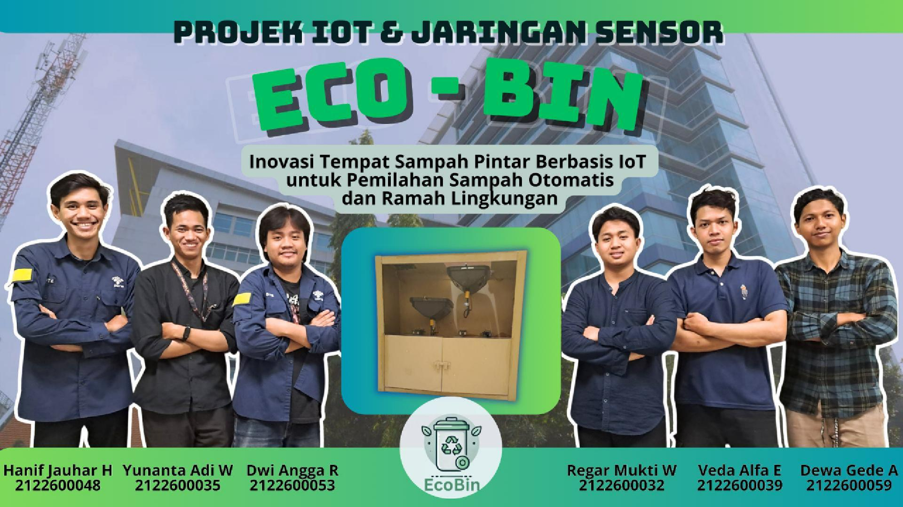
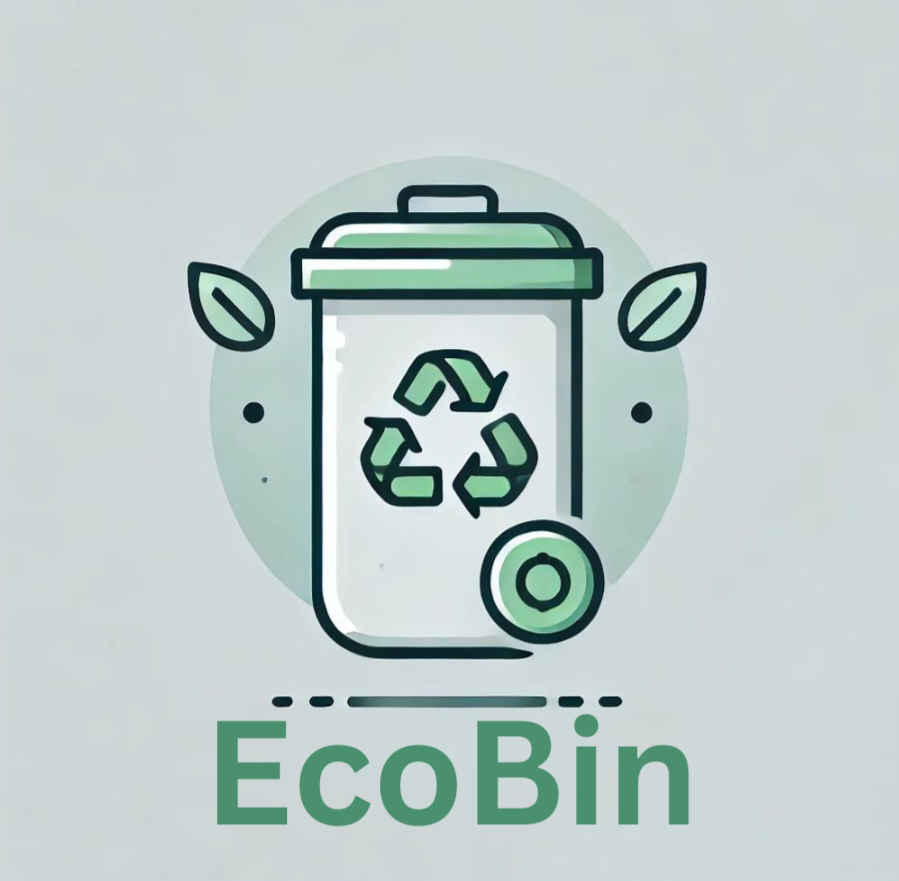
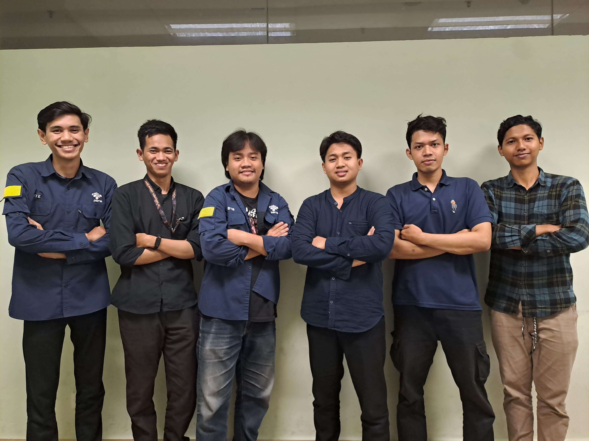

# Logo EcoBin

Inovasi Tempat Sampah Pintar Berbasis IoT untuk Pemilahan Sampah Otomatis dan Ramah Lingkungan.

EcoBin adalah konsep pengembangan tempat sampah masa depan yang mengintegrasikan teknologi Internet of Things (IoT) untuk meningkatkan efisiensi dan akurasi dalam pemilahan sampah. Dengan EcoBin, pemisahan jenis sampah seperti organik, anorganik, dan logam kini bisa dilakukan secara otomatis, berkat penggunaan sensor-sensor canggih yang terhubung ke jaringan.

Sistem ini tidak hanya mendukung keberlanjutan lingkungan dengan pemilahan sampah yang lebih tepat dan ramah lingkungan, tetapi juga memberikan solusi modern dan praktis dalam pengelolaan sampah di rumah maupun di tempat umum. Hebatnya lagi, EcoBin dapat dimonitor dari jarak jauh melalui internet, memungkinkan Anda untuk memantau kapasitas dan kondisi sampah secara real-time tanpa perlu repot membuka tempat sampah secara manual.

Dengan EcoBin, kita bisa bersama-sama berkontribusi untuk mengurangi limbah, mendukung gerakan reduce, reuse, recycle, dan menjaga kebersihan lingkungan secara lebih efektif dengan teknologi terkini. 
## Didukung Oleh :
>- Dosen Pengampu : Akhmad Hendriawan ST., MT. (NIP.197501272002121003)
>- Mata kuliah : IoT dan Jaringan Sensor
>- Program Studi : D4 Teknik Elektronika
>- Politeknik Elektronika Negeri Surabaya 

## Team Member :

  

|      NRP      |       Nama      |    Jobdesk    |   Akun |
| :-----------:|:----------------:| :------------:| :-----:|
| 2122600032    | Regar Mukti Wijaya  | Hardware Developer       | [Reigar304](https://github.com/Regar304)
| 2122600035    | Yunanta Adi Wijaya        |  Data Analyst | [WAYs-s](https://github.com/WAYs-s)
| 2122600039    | Veda Alfa Elydal        |    Software Developer      | [Vedaalfaelydal](https://github.com/Vedaalfaelydal)
| 2122600048    | Hanif Jauhar Islami              | Project Manager | [HanifJauharIslami](https://github.com/HanifJauharIslami)
| 2122600053    | Dwi Angga Ramadhani               | UI/UX Designer     | [dwiangga12](https://github.com/dwiangga12)
| 2122600059    | Dewa Gede Angkasa Arinanta              | 3D Designer     |[dede-akgs](https://github.com/dede-akgs)

## Daftar Isi
- [Komponen Yang Digunakan](#Komponen-Yang-Digunakan)
- [Hardware](#Hardware)
- [Desain 3D](#Desain-3D)
- [Program ESP32](#Program-ESP32)
- [Program Design UI/UX](#Pogram-Design-UI/UX)

 
## Komponen Yang Digunakan
1. **Hardware** 
    a. ESP32 
    b. Sensor Ultrasonik 
    c. Sensor Proximity Induktif 
    d. Sensor Proximity Kapasitif 
    e. Sensor Proximity Infrared 
    f. Motor Servo 
    g. LCD 20X4 I2C 
    h. Modul Df Player  
    i. Speaker  
    j. Power Supply  
    k. SD Card 

2. **Software** 
    a. Arduino ide 
    b. KiCad 
    c. Inventor 
    d. Visual Studio Code (VSC) 
    e. Eagle 
    f. Canva 

3. **Alat dan Bahan** 
    a. Solder 
    b. Timah solder 
    c. Kabel jumper 
    d. Breadboard 
    e. Obeng 
    f. Bor tangan 
    g. Lem 
    h. Isolasi 
    i. Penggaris 
    j. Tang potong 
    k. AVO meter 
    l. Kabel Tis 
    m. Tong sampah 
    n. Kertas karton 
    o. Plastik mika 
 
## Hardware

Berikut ini adalah hasil skematik rangkaian EcoBin menggunakan software KiCad. 

**Schematic Design**

  

**Board Design**

  

**3D Board Depan**

  

**Hasil PCB**

  

## Desain 3D

1. Desain 3D Tampak Depan  

2. Desain 3D Tampak Samping  

3. Desain 3D Tampak Belakang  

Berikut adalah Link Thingivers Design 3D [Thingivers](https://www.thingiverse.com/thing:6826473).  
Klik link Video Simulasi Software [Video](https://drive.google.com/file/d/1z52mZQDJVuQlTp9NXhlNtxdHz51nXP60/view?usp=sharing).

## Final Product

 Hasil jadi prototype EcoBin 
 

## Program ESP32

Program utama dari projek ini :
- [EcoBin Code](https://github.com/HanifJauharIslami/EcoBin/blob/f4bee43d3d4f70b857a67019edb6326d1a9f5407/Source%20Code%20ESP/Source%20Code%20ESP32.ino)

Berikut ini adalah hasil Rangkaian Simulasi EcoBin menggunakan platform Wokwi.

Pada simulasi ini, ESP32 digunakan sebagai microcontroller untuk mengendalikan input dan output yang terhubung ke breadboard. Proses simulasi dilakukan di platform Wokwi, yang memudahkan pengujian rangkaian secara virtual sebelum diaplikasikan secara fisik. Rangkaian ini melibatkan Sensor Ultrasonik untuk mengukur kapasitas sampah, LCD 20X4 I2C yang menampilkan informasi kapasitas sampah, slide switch yang berfungsi sebagai pengganti sensor proximity induktif, kapasitif, dan inframerah, serta servo sebagai pemilah atas-bawah dan sebagai penutup ketika sampah sudah penuh. Speaker juga digunakan untuk memberikan notifikasi suara saat sampah penuh atau mencapai kapasitas maksimum.

Simulasi ini sangat berguna untuk proses debugging dan memastikan komunikasi antar-komponen berfungsi dengan baik. Meskipun Wokwi tidak menyediakan semua komponen, platform ini tetap sangat berguna untuk pengujian dan visualisasi fungsi dasar rangkaian, sehingga membantu dalam mengidentifikasi masalah sebelum proses produksi fisik.

Berikut adalah video demontrasi simulasi rangkaian menggunakan platform Wokwi. Klik link [Video Simulasi Software](https://youtu.be/CGCrU7WQCkA  "Video Simulasi Software").

Klik link [WOKWI SIMULATION](https://wokwi.com/projects/411379523365083137  "WOKWI SIMULATION") untuk menjalankan simulasi pada platform Wokwi.

## [Design UI/UX]
Berikut ini adalah video demonstrasi dari UI/UX EcoBin [UI/UX Figma](https://github.com/HanifJauharIslami/EcoBin/blob/main/Desain%20%26%20Perencanaan/Desain%20UI%20UX/Video%20Simulasi%20Desain%20UI%20UX.mp4)
yang dirancang dengan cermat melalui Figma! Saksikan bagaimana tampilan antarmuka yang modern, intuitif, dan ramah pengguna ini dapat memudahkan pengelolaan sampahmu sekaligus mendukung gaya hidup berkelanjutan. Yuk, jelajahi pengalaman baru bersama EcoBin.

## [Dokumentasi Presentasi]
Untuk file dokumentasi presentasi yang mencakup progres keseluruhan dari project ini, dapat diakses melalui link berikut
https://www.canva.com/design/DAGW5qldhn8/VcVr3ikPfyFXVI_1jrsfLQ/edit 

## [Video Simulasi EcoBin]
https://github.com/user-attachments/assets/16c2eb3c-403b-46f2-9d4a-512dc8649475

## [Video Iklan EcoBin]
https://github.com/user-attachments/assets/9ff95b26-ae8f-4da3-ab34-a3e6bbd686d2

## [Video Presentasi]
https://github.com/user-attachments/assets/311d540c-b6a1-4b6d-8765-bba1ee726d60

## [Video Animasi 3D Sistem]
https://github.com/user-attachments/assets/8d097e46-a294-48c1-8112-243f85b5fb7d
